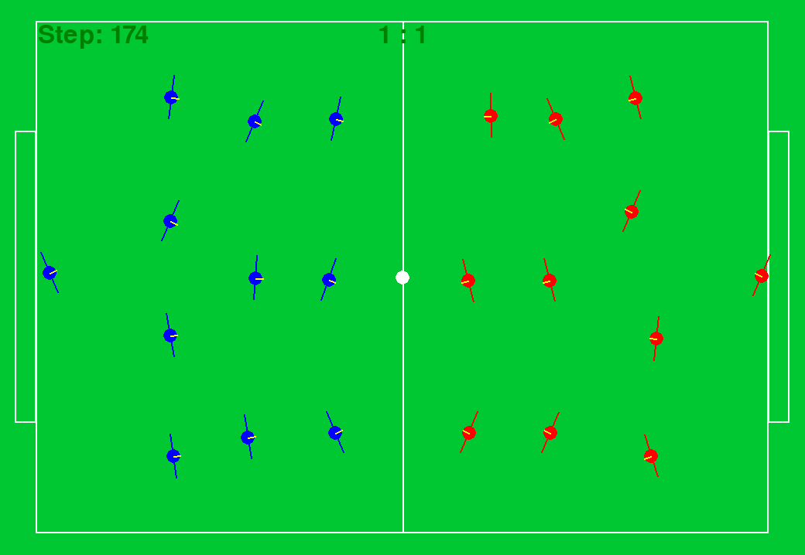
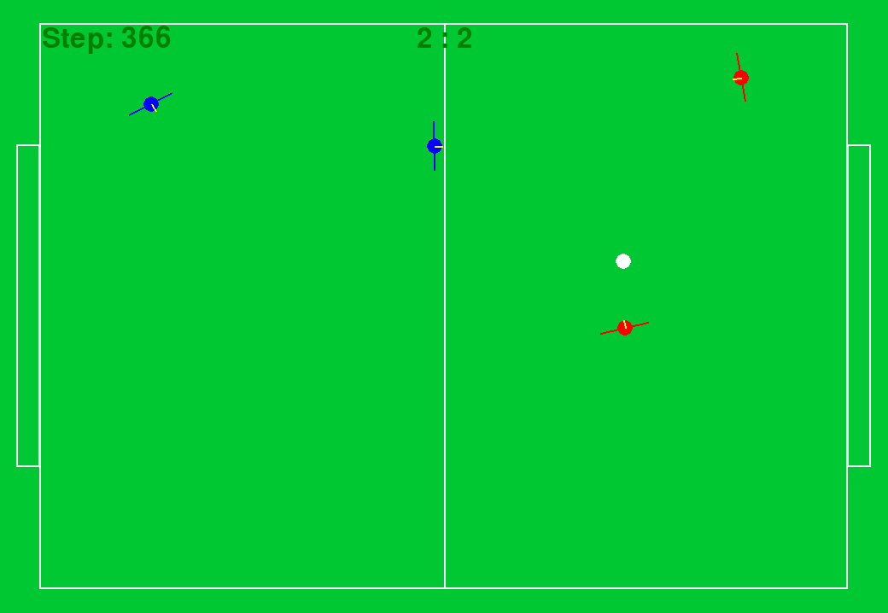
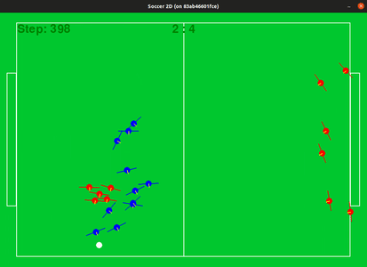

# MARL2DFootball
MARL2DFootball is a lightweight 2D football environment that can be used for training multi-agent reinforcement learning systems. The environment provides partially observations to each players and can run anything from 1 vs 1 player up to 11 vs 11 player matches.

# Environment
Top view of the 2D football environment for 22 players and 4 players respectively.
<p style="text-align:center;">


</p>

Multi agent reinforcement learing agents (trained for 35 hours) in blue playing against a handcrafted opponent in red. 

<p align="center">
  
</p>

# Installation

This instalation was tested on an Linux (Ubuntu 21.04) machine.
### Virtual Environment (**Recommended**)

Run the below commands to setup this football environment and run the main example.
```
make build_env   # Setup the virtual environment
make run     # Run the main example file.
```
You can replace the example with your custom python file by editing the makefile.

